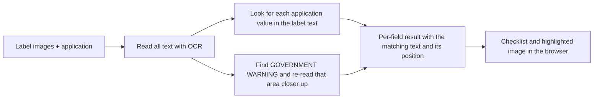

# Label Check

A prototype that helps TTB compliance agents compare an alcohol label with its COLA application. You upload the label images, enter (or import) what the application says, and it reports field by field whether the label matches, with the spot on the label it matched highlighted.

It is a helper for the reviewer, not an approval system. Every field comes back as **Matches**, **Needs review**, **Does not match** or **Not checked**, and the agent makes the call.

**Live app:** _added after deployment_

## Trying it

The quickest way is the example buttons in the app:

- **Check one label** has examples for a matching label, a label with a problem, a label that needs review, and an image that is too poor to read. Each loads a sample label and application and runs the check.
- **Check many labels** has "Load an example batch", which loads a 16-row spreadsheet and its images.
- You can also try any of the other example buttons to see how the checker handles different scenarios.

Sample images are in `frontend/public/samples/`. The full test set with expected results is in `eval/`.

A single label's results have a "Print these results" button, which opens every item and prints the checklist and the label without the on-screen controls.

## What it checks

| Field | How it is compared |
| --- | --- |
| Brand name, class or type | Same words, ignoring case, punctuation and spacing. `STONE'S THROW` on the label matches `Stone's Throw` in the application, with a note that the capitalization differs. A near miss (one or two letters off) is marked for review. |
| Alcohol content | The percentage is compared as a number. An application that states only the proof (`90 Proof`) is read as half that. If the label also shows proof, it has to be twice the ABV. |
| Net contents | Converted to mL (mL, cL, L and fl oz are understood) and compared within 1.5%, so `12 FL OZ` matches `355 mL`. |
| Bottler or producer | Each comma-separated part of the name and address must appear. State names and abbreviations count as the same (`Kentucky` / `KY`). Unconfirmed results get one enlarged crop read of the likely producer line. |
| Country of origin | Checked only when the application gives one. A country name embedded in other text, such as `India Pale Ale`, needs review unless there is an origin statement or a separate country line. |
| Government warning | Word for word against the statement in 27 CFR 16.21. `GOVERNMENT WARNING` must be in capital letters and bold (16.22). Missing, extra or changed words are shown as a diff. |

A field left empty in the application is reported as Not checked, which covers wine and beer where alcohol content is optional.

## Running locally

You need Python 3.12 with [uv](https://docs.astral.sh/uv/) and Node 22 or newer.

Build the frontend once and let the backend serve it:

```bash
cd frontend
npm ci
npm run build
cp -r dist ../backend/static

cd ../backend
uv sync
uv run uvicorn app.main:app --port 8000
```

Then open http://localhost:8000. The first start takes a few seconds while the OCR models load.

For frontend work, run the backend as above and `npm run dev` in `frontend/`. Vite proxies `/api` to port 8000.

With Docker:

```bash
docker build -t label-check .
docker run -p 8000:8000 label-check
```

Tests and the accuracy check:

```bash
cd backend
uv run pytest
uv run python scripts/evaluate.py
```

## How it works



**It checks, it doesn't extract.** The application already says what the brand, ABV and so on should be, so the app searches the label text for those values instead of trying to work out on its own which text is the brand name. That is a much easier problem, it is deterministic, and every result can be traced back to a line on the label.

**OCR** is [RapidOCR](https://github.com/RapidAI/RapidOCR) (PaddleOCR models running on ONNX Runtime) on the CPU. The models ship inside the Python package, so nothing is downloaded or sent anywhere at runtime.

**The warning statement** is the hard part. It is usually the smallest, most tightly spaced text on the label, and the text detector sometimes merges two of its lines into one garbled line. When the first read of the warning is incomplete or low confidence, the app crops the warning area, enlarges it and reads it again at up to three scales, keeping the most complete and confident reading. The decision to try another scale looks only at confidence and word count, never at whether the words match, so a real misprint like `pregnacy` is still reported as a misprint.

Sloping warning lines use tighter detection boundaries during the crop read. Wider boxes can include neighboring lines and confuse the recognizer. Flat labels retain the original boundaries, which worked better on the flat-label tests. Producer crops also use tighter boundaries. A producer crop replaces the original result only when that reading confirms the whole name and address; fuzzy matches still need review.

A word that differs from the statement fails the check when the OCR was confident about it. If the OCR was unsure, the result is Needs review instead, so a blurry photo does not produce a false rejection. The same idea decides what a missing word means: words missing between two confidently read words are missing from the label, while words missing off the end usually mean the reading stopped early at a crop edge or a curved bottle.

**Spacing is not wording.** The recognizer splits and joins words around punctuation, reading "WARNING: (1)" as one word on tightly set labels. Since that cannot be told apart from the label's own spacing, and the regulation is about the words, differences that disappear when the spacing is removed are treated as a match.

**Small print is read, not excused.** Warning text is the smallest print on a label, and in a photo of a bottle it is often a few pixels tall and curves away with the glass. When the first pass misses it, the app finds the smallest text on the label and reads that area again in three overlapping strips, so each pass sees a short, nearly straight piece of every line. Pieces of the same line are matched by their baselines, straightened, joined back together and read as one line. That works from the shape of the text, not from where the warning usually sits or what it ought to say, so a misprint survives the rebuild: a label printed "pregnacy" still reads "pregnacy" afterwards and a title-case heading stays title case, which is covered by tests. Only when the recovery also fails does the app say it could not read enough text to verify the warning, and it never calls the warning missing on an image too small to have shown it.

**Capital letters:** OCR often guesses the case of letters like `o`, `s`, `v` and `w` wrong because the capital and small forms look the same, so it returned `GoVERNMENT` on correctly printed labels. The caps check ignores those letters and only looks at letters whose shapes differ. Title case (`Government Warning`) is still caught because `e`, `r`, `n`, `m` and `t` give it away.

**Bold:** the heading's stroke thickness is compared with the body text next to it. On the test set, bold headings measured 1.26 to 1.38 times the body stroke width and a regular-weight heading 1.04. Anything under 1.15 is marked Needs review (not a failure), and the result shows a close-up of the heading so the agent can confirm in a second.

**Batches** are driven by the browser. It reads the CSV, shrinks large images, and sends labels to the same `/api/verify` endpoint three at a time, updating the table as results come back. The server stays stateless and stores nothing.

## Decisions and trade-offs

- **Local OCR instead of a cloud AI service.** Marcus mentioned that the agency firewall blocks many outbound ML endpoints and that the last vendor pilot broke because of it. Running OCR in the container avoids that, keeps label images inside the deployment, and costs nothing per label. I also avoided using a vision LLM to read the warning: they tend to "correct" text toward what they expect, and a well known statement like this one is exactly where a misspelling could be silently fixed.
- **Speed.** Sarah's bar was about 5 seconds. The 19-case local evaluation averaged 1.86 s, with a 1.63 s median and 3.54 s at the 95th percentile (including image decoding, excluding network upload). The supplied can photo took 1.99 s and the hardest case, a rotated and blurred photo, 4.25 s. Only one label is read at a time, so OCR gets the whole machine: the default is at most 4 threads, which is the vCPU count of the instance this is sized for, and past that ONNX Runtime spends more time coordinating than reading. `OCR_THREADS` overrides it. These are desktop numbers and cloud latency still needs measurement.
- **One OCR job at a time per server.** OCR already uses all its threads for a single label, so running two at once just makes both slower. Extra requests queue for up to 30 seconds, then get a "busy, try again" response that the batch page retries automatically. A request that has gone unanswered for 60 seconds is given up on with a message, rather than leaving a reviewer watching a spinner. At roughly 2 seconds a label, a 300-label batch takes about 10 minutes on one instance. More throughput means more instances.
- **Nothing stored.** Images are processed in memory and dropped. The downside is that batch results only live in the browser tab until you download the CSV, and closing the tab mid-batch loses progress (the page warns first).
- **Looks like a government tool, not a dashboard.** The interface builds on USWDS, on a warm off-white ground rather than stark white, with a navy header and a single gold accent. Label artwork is cream and white paper, so a dark or heavily tinted interface would fight the thing being reviewed, and low contrast is the wrong choice for a team where half the reviewers are over 50. Motion is limited to showing where new content came from: results rise into place, statuses settle, the batch bar fills. All of it is disabled under prefers-reduced-motion.
- **Built to fit on a screen.** Images and application details sit side by side, the check button stays in reach at the bottom, and results that matched collapse to one line so the items needing a decision are what you see. A reviewer working a queue should not have to scroll to find the problem.
- **USWDS for the interface.** It is the federal design system, so agents will find it familiar, and it handles accessibility basics well. Text is larger than the default, there is one main action per step, and statuses always use words and icons, never color alone.
- **Python rather than .NET.** COLA is .NET, but the OCR and image tooling in Python is far better. The checker is a plain HTTP API, so a .NET system could call it later.

## Assumptions

- Most images are the flat label artwork submitted with an application. Photos of bottles are handled on a best-effort basis.
- Labels are in English.
- Application data is typed in by the agent or supplied in a CSV. There is no COLA integration.
- Only the heading's case and weight are enforced. 16.22 does not require the rest of the statement to be in any particular case, so an all-caps warning is accepted.

## Project layout

```
backend/
  app/
    main.py        API endpoints and upload handling
    verify.py      runs OCR and the checks for one label
    ocr.py         image loading and OCR
    fields.py      brand, class, alcohol, net contents, bottler, origin
    warning.py     government warning checks
    text.py        text normalization
  scripts/         test label generator and accuracy check
  tests/
frontend/
  src/
    pages/         single label and batch screens
    components/
eval/              test labels and expected results
Dockerfile
```

## Tools and libraries

FastAPI, RapidOCR, ONNX Runtime, OpenCV, Pillow and RapidFuzz on the backend. React, TypeScript, Vite, USWDS and Papa Parse on the frontend. Test label artwork was generated with ChatGPT.
